# Thiết Kế Cơ Sở Dữ Liệu - Project Thuy Chi

Tài liệu này mô tả thiết kế cơ sở dữ liệu dựa trên phân tích cấu trúc Front-End (Angular) và các tính năng UI hiện có của dự án.

## 1. Tổng Quan

Hệ thống cần lưu trữ:

- **Người dùng (Users)**: Thông tin các bé, phụ huynh, độ tuổi, avatar.
- **Môn học (Subjects)**: Toán, Tiếng Việt, Tiếng Anh, Trò Chơi.
- **Cấp độ/Bài học (Levels)**: Chi tiết từng module học (Ví dụ: Đếm số, Bảng chữ cái, Phép cộng).
- **Nội dung bài học (Questions)**: Các câu hỏi, bài tập cụ thể.
- **Tiến độ học tập (Progress)**: Trạng thái hoàn thành, số sao, điểm số của người dùng.
- **Lịch sử học tập chi tiết (Learning Sessions)**: Lưu từng phiên học với chi tiết từng câu hỏi.
- **Thành tích/Huy hiệu (Achievements/Badges)**: Hệ thống gamification.
- **Cài đặt (Settings)**: Tùy chọn cá nhân hóa cho từng người dùng.
- **Thông báo (Notifications)**: Nhắc nhở học tập, thông báo thành tích.

Mô hình được đề xuất là **Lai (Hybrid)**: Sử dụng các bảng quan hệ (Relational) cho cấu trúc chính và JSON cho nội dung bài tập đa dạng và cấu hình linh hoạt.

## 2. Mô Hình Quan Hệ (ER Diagram)

```mermaid
erDiagram
    USERS ||--o{ USER_PROGRESS : "has"
    USERS ||--o{ LEARNING_SESSIONS : "completes"
    USERS ||--o{ USER_ACHIEVEMENTS : "earns"
    USERS ||--o{ USER_SETTINGS : "has"
    USERS ||--o{ NOTIFICATIONS : "receives"
    USERS ||--o{ PARENT_GATE_ATTEMPTS : "attempts"
    
    SUBJECTS ||--|{ LEVELS : "contains"
    LEVELS ||--|{ QUESTIONS : "contains"
    LEVELS ||--o{ USER_PROGRESS : "tracks"
    LEVELS ||--o{ LEARNING_SESSIONS : "belongs_to"
    LEVELS ||--o{ MASCOT_MESSAGES : "has_feedback"
    
    LEARNING_SESSIONS ||--|{ QUESTION_ATTEMPTS : "contains"
    QUESTIONS ||--o{ QUESTION_ATTEMPTS : "answered_in"
    
    ACHIEVEMENTS ||--o{ USER_ACHIEVEMENTS : "awarded_to"

    USERS {
        int id PK
        string username
        string full_name
        int age
        string avatar_url
        string role "child, parent"
        datetime created_at
        datetime last_active
    }

    SUBJECTS {
        string id PK "e.g. math, vietnamese, english, games"
        string title "Toán Học"
        string icon "🔢"
        json theme_config "colors, gradients"
        string description
        boolean active
        int sort_order
    }

    LEVELS {
        string id PK "e.g. counting, alphabet, addition"
        string subject_id FK
        string title "Đếm Số 0-10"
        string subtitle "Nhận biết và đếm từ 0 đến 10"
        string icon "🔢"
        string route "/math/counting"
        boolean is_free
        int level_number
        json ui_config "colors, gradients, animations"
        int min_age
        int max_age
        int estimated_duration "minutes"
    }

    QUESTIONS {
        int id PK
        string level_id FK
        string question_type "sorting, calculation, multiple-choice, flashcard"
        text content "JSON: items, answers, config"
        int order_index
        int points "điểm cho câu hỏi này"
        json metadata "extra config"
    }

    USER_PROGRESS {
        int id PK
        int user_id FK
        string level_id FK
        int stars "0-3"
        string status "LOCKED, UNLOCKED, IN_PROGRESS, COMPLETED"
        int high_score
        int total_attempts
        datetime first_played_at
        datetime last_played_at
        datetime completed_at
    }
    
    LEARNING_SESSIONS {
        int id PK
        int user_id FK
        string level_id FK
        datetime started_at
        datetime completed_at
        int duration_seconds
        int score "số câu đúng"
        int total_questions
        float accuracy_percentage
        boolean completed
        json session_metadata "device, browser, etc"
    }
    
    QUESTION_ATTEMPTS {
        int id PK
        int session_id FK
        int question_id FK
        int question_number "thứ tự trong session"
        string question_text "nội dung câu hỏi"
        string user_answer
        string correct_answer
        boolean is_correct
        int time_spent_seconds
        int attempts_count "số lần thử"
        datetime answered_at
    }
    
    ACHIEVEMENTS {
        int id PK
        string achievement_id "unique_slug"
        string title "Nhà Toán Học Nhí"
        string description "Hoàn thành 50 bài toán"
        string icon "🧮"
        string rarity "common, rare, epic, legendary"
        json unlock_criteria "conditions to unlock"
        int points "điểm thưởng"
        string category "learning, streak, perfect_score, speed"
        boolean active
    }
    
    USER_ACHIEVEMENTS {
        int id PK
        int user_id FK
        int achievement_id FK
        datetime earned_at
        json earned_context "what triggered it"
        boolean notified
    }
    
    USER_SETTINGS {
        int id PK
        int user_id FK
        json learning_settings "daily_goal, study_time, difficulty, auto_advance"
        json notification_settings "daily_reminder, reminder_time, achievement_notify, weekly_report"
        json parental_controls "parent_gate, screen_time_limit"
        json audio_settings "sound_effects, background_music, voice_guide, volume"
        json ui_settings "theme, language, font_size, animations"
        datetime updated_at
    }
    
    NOTIFICATIONS {
        int id PK
        int user_id FK
        string type "reminder, achievement, weekly_report, milestone"
        string title
        string message
        json data "extra info"
        boolean read
        datetime scheduled_for
        datetime sent_at
        datetime read_at
    }
    
    PARENT_GATE_ATTEMPTS {
        int id PK
        int user_id FK
        int num1
        int num2
        int user_answer
        boolean is_correct
        string ip_address
        datetime attempted_at
    }
    
    MASCOT_MESSAGES {
        int id PK
        string level_id FK
        string trigger_type "start, correct, wrong, complete, encourage"
        string message_template
        int priority
    }
```



## 3. Chi Tiết Các Bảng

### 3.1. Bảng `users`

Lưu thông tin người dùng (cả bé và phụ huynh).

| Column | Type | Description |
|--------|------|-------------|
| `id` | INT (PK) | Auto increment |
| `username` | VARCHAR | Tên đăng nhập (nếu có) |
| `full_name` | VARCHAR | Tên hiển thị của bé |
| `age` | INT | Tuổi (để gợi ý bài học phù hợp) |
| `avatar_url` | VARCHAR | Link ảnh đại diện hoặc emoji avatar |
| `role` | ENUM('child', 'parent') | Vai trò người dùng |
| `created_at` | DATETIME | Ngày tạo tài khoản |
| `last_active` | DATETIME | Lần hoạt động gần nhất |

### 3.2. Bảng `subjects`

Danh mục chính (Toán, Tiếng Việt...). Dữ liệu gốc từ `subjects.json`.

| Column | Type | Description |
|--------|------|-------------|
| `id` | VARCHAR (PK) | Mã môn học (math, vietnamese). Dùng String để dễ mapping FE. |
| `title` | VARCHAR | Tên hiển thị (Toán Học) |
| `icon` | VARCHAR | Emoji hoặc đường dẫn icon |
| `theme_config` | JSON | Lưu mã màu (`#3b82f6`) và gradient. Loại bỏ việc cứng cột màu. |
| `description` | TEXT | Mô tả ngắn |
| `active` | BOOLEAN | Ẩn/Hiện môn học |

### 3.3. Bảng `levels` (Modules)

Các bài học con (Đếm số, So sánh, Chữ cái...). Dữ liệu gốc từ `math-levels.json`, `vietnamese-levels.json`.

| Column | Type | Description |
|--------|------|-------------|
| `id` | VARCHAR (PK) | Mã bài học (counting, simple-words) |
| `subject_id` | VARCHAR (FK) | Thuộc môn nào (math, vietnamese) |
| `title` | VARCHAR | Tên bài (Đếm số) |
| `subtitle` | VARCHAR | Mô tả ngắn (Nhận biết 0-10) |
| `level_number` | INT | Số thứ tự bài học (1, 2, 3...) |
| `route` | VARCHAR | Đường dẫn Angular route (`/math/counting`) |
| `ui_config` | JSON | Chứa `color`, `gradient` riêng của từng level |
| `min_age` | INT | Độ tuổi tối thiểu khuyến nghị |

### 3.4. Bảng `questions`

Nội dung chi tiết từng màn chơi. Dữ liệu gốc từ các file `*-config.json` (ví dụ `sorting-config.json`).
*Lý do dùng cột `content` kiểu JSON*: Mỗi game (Sorting, Fill-in-blank, Logic) có cấu trúc dữ liệu hoàn toàn khác nhau.

| Column | Type | Description |
|--------|------|-------------|
| `id` | INT (PK) | Auto increment |
| `level_id` | VARCHAR (FK) | Thuộc level nào |
| `question_type` | VARCHAR | Loại câu hỏi (`sorting`, `calculation`, `find_missing`) |
| `content` | JSON | Chứa toàn bộ logic câu hỏi. |
| `order_index` | INT | Thứ tự xuất hiện câu hỏi |

**Ví dụ cấu trúc JSON trong cột `content`:**

#### a. Dạng bài 'Sắp xếp' (Static List - Sorting)

*Dữ liệu tĩnh, liệt kê chính xác từng câu hỏi.*

```json
{
  "question_text": "Sắp xếp các số theo thứ tự từ bé đến lớn",
  "data": {
    "order": "asc",
    "items": [5, 2, 8, 1],
    "correct_sequence": [1, 2, 5, 8]
  }
}
```

#### b. Dạng bài 'Tính toán' (Dynamic Config - Addition/Subtraction)

*Dữ liệu cấu hình, FE sẽ tự sinh câu hỏi ngẫu nhiên trong khoảng quy định.*

```json
{
  "mode": "dynamic_generation",
  "config": {
    "operator": "+",
    "range": { "min": 2, "max": 10 },
    "total_questions": 10,
    "points_per_question": 10,
    "ui_elements": ["apples", "ducks", "stars"] // Icon hiển thị
  },
  "feedback": {
    "correct": ["Giỏi quá!", "Đúng rồi!"],
    "wrong": ["Thử lại nhé!", "Sai rồi!"]
  }
}
```

#### c. Dạng bài 'Tiếng Việt' (Learning Content - Vietnamese)

*Dữ liệu dạng bài học (Flashcards), chứa ký tự, âm thanh và ví dụ.*

```json
{
  "type": "flashcard",
  "items": [
    {
      "id": "a",
      "text": "a",
      "audio_url": "/assets/audio/vn/a.mp3",
      "example": {
        "word": "cá",
        "image_url": "/assets/images/fish.png",
        "audio_url": "/assets/audio/vn/ca.mp3"
      }
    },
    {
      "id": "ă",
      "text": "ă",
      "audio_url": "/assets/audio/vn/aw.mp3",
      "example": {
        "word": "mặt trăng",
        "image_url": "/assets/images/moon.png",
        "audio_url": "/assets/audio/vn/mat-trang.mp3"
      }
    }
  ]
}
```

### 3.5. Bảng `user_progress`

Lưu tiến độ tổng quan của người dùng cho từng level.

| Column | Type | Description |
|--------|------|-------------|
| `id` | INT (PK) | Auto increment |
| `user_id` | INT (FK) | Người chơi |
| `level_id` | VARCHAR (FK) | Bài học |
| `stars` | INT | Số sao đạt được (0-3) |
| `status` | ENUM | `LOCKED`, `UNLOCKED`, `IN_PROGRESS`, `COMPLETED` |
| `high_score` | INT | Điểm cao nhất |
| `total_attempts` | INT | Tổng số lần chơi |
| `first_played_at` | DATETIME | Lần chơi đầu tiên |
| `last_played_at` | DATETIME | Lần chơi gần nhất |
| `completed_at` | DATETIME | Thời gian hoàn thành (nếu đã hoàn thành) |

### 3.6. Bảng `learning_sessions`

Lưu chi tiết từng phiên học (session) - **Quan trọng cho Parent Dashboard và Learning History**.

| Column | Type | Description |
|--------|------|-------------|
| `id` | INT (PK) | Auto increment |
| `user_id` | INT (FK) | Người chơi |
| `level_id` | VARCHAR (FK) | Bài học |
| `started_at` | DATETIME | Thời gian bắt đầu |
| `completed_at` | DATETIME | Thời gian kết thúc |
| `duration_seconds` | INT | Thời lượng (giây) |
| `score` | INT | Số câu đúng |
| `total_questions` | INT | Tổng số câu hỏi |
| `accuracy_percentage` | FLOAT | Tỷ lệ chính xác (%) |
| `completed` | BOOLEAN | Đã hoàn thành hay chưa |
| `session_metadata` | JSON | Thông tin thêm (device, browser, IP) |

**Ví dụ session_metadata:**

```json
{
  "device": "mobile",
  "browser": "Chrome",
  "ip_address": "192.168.1.1"
}
```

### 3.7. Bảng `question_attempts`

Lưu chi tiết từng câu hỏi trong mỗi session - **Hiển thị trong Learning History chi tiết**.

| Column | Type | Description |
|--------|------|-------------|
| `id` | INT (PK) | Auto increment |
| `session_id` | INT (FK) | Thuộc session nào |
| `question_id` | INT (FK) | Câu hỏi nào |
| `question_number` | INT | Thứ tự câu hỏi trong session (1, 2, 3...) |
| `question_text` | TEXT | Nội dung câu hỏi (lưu lại để hiển thị) |
| `user_answer` | VARCHAR | Câu trả lời của bé |
| `correct_answer` | VARCHAR | Đáp án đúng |
| `is_correct` | BOOLEAN | Đúng hay sai |
| `time_spent_seconds` | INT | Thời gian làm câu này (giây) |
| `attempts_count` | INT | Số lần thử (nếu cho phép thử lại) |
| `answered_at` | DATETIME | Thời gian trả lời |

### 3.8. Bảng `achievements`

Định nghĩa các huy hiệu/thành tích trong hệ thống.

| Column | Type | Description |
|--------|------|-------------|
| `id` | INT (PK) | Auto increment |
| `achievement_id` | VARCHAR (UNIQUE) | Mã định danh duy nhất (slug) |
| `title` | VARCHAR | Tên huy hiệu (Nhà Toán Học Nhí) |
| `description` | TEXT | Mô tả (Hoàn thành 50 bài toán) |
| `icon` | VARCHAR | Emoji icon (🧮) |
| `rarity` | ENUM | `common`, `rare`, `epic`, `legendary` |
| `unlock_criteria` | JSON | Điều kiện mở khóa |
| `points` | INT | Điểm thưởng khi đạt được |
| `category` | VARCHAR | Loại (learning, streak, perfect_score, speed) |
| `active` | BOOLEAN | Còn hiệu lực không |

**Ví dụ unlock_criteria:**

```json
{
  "type": "total_lessons_completed",
  "subject": "math",
  "count": 50
}
```

hoặc

```json
{
  "type": "streak_days",
  "days": 7
}
```

### 3.9. Bảng `user_achievements`

Lưu các huy hiệu mà người dùng đã đạt được.

| Column | Type | Description |
|--------|------|-------------|
| `id` | INT (PK) | Auto increment |
| `user_id` | INT (FK) | Người dùng |
| `achievement_id` | INT (FK) | Huy hiệu |
| `earned_at` | DATETIME | Thời gian đạt được |
| `earned_context` | JSON | Ngữ cảnh đạt được (session nào, level nào) |
| `notified` | BOOLEAN | Đã thông báo cho user chưa |

### 3.10. Bảng `user_settings`

Lưu cài đặt cá nhân hóa của người dùng - **Dùng cho Parent Settings**.

| Column | Type | Description |
|--------|------|-------------|
| `id` | INT (PK) | Auto increment |
| `user_id` | INT (FK) | Người dùng |
| `learning_settings` | JSON | Cài đặt học tập |
| `notification_settings` | JSON | Cài đặt thông báo |
| `parental_controls` | JSON | Kiểm soát phụ huynh |
| `audio_settings` | JSON | Cài đặt âm thanh |
| `ui_settings` | JSON | Cài đặt giao diện |
| `updated_at` | DATETIME | Lần cập nhật gần nhất |

**Ví dụ learning_settings:**

```json
{
  "daily_goal": "3 bài",
  "study_time": "30 phút",
  "difficulty": "Trung bình",
  "auto_advance": true
}
```

**Ví dụ notification_settings:**

```json
{
  "daily_reminder": true,
  "reminder_time": "19:00",
  "achievement_notify": true,
  "weekly_report": true
}
```

**Ví dụ parental_controls:**

```json
{
  "parent_gate_enabled": true,
  "screen_time_limit": "1 giờ"
}
```

**Ví dụ audio_settings:**

```json
{
  "sound_effects": true,
  "background_music": true,
  "voice_guide": true,
  "volume": "Trung bình"
}
```

**Ví dụ ui_settings:**

```json
{
  "theme": "Sáng",
  "language": "Tiếng Việt",
  "font_size": "Trung bình",
  "animations": true
}
```

### 3.11. Bảng `notifications`

Lưu thông báo cho người dùng.

| Column | Type | Description |
|--------|------|-------------|
| `id` | INT (PK) | Auto increment |
| `user_id` | INT (FK) | Người nhận |
| `type` | VARCHAR | Loại (reminder, achievement, weekly_report, milestone) |
| `title` | VARCHAR | Tiêu đề thông báo |
| `message` | TEXT | Nội dung |
| `data` | JSON | Dữ liệu thêm (achievement_id, session_id, etc) |
| `read` | BOOLEAN | Đã đọc chưa |
| `scheduled_for` | DATETIME | Lên lịch gửi lúc nào |
| `sent_at` | DATETIME | Thời gian gửi thực tế |
| `read_at` | DATETIME | Thời gian đọc |

### 3.12. Bảng `parent_gate_attempts`

Lưu lịch sử xác thực Parent Gate - **Bảo mật và tracking**.

| Column | Type | Description |
|--------|------|-------------|
| `id` | INT (PK) | Auto increment |
| `user_id` | INT (FK) | Người thử (nullable nếu chưa đăng nhập) |
| `num1` | INT | Số thứ nhất trong phép tính |
| `num2` | INT | Số thứ hai |
| `user_answer` | INT | Câu trả lời người dùng nhập |
| `is_correct` | BOOLEAN | Đúng hay sai |
| `ip_address` | VARCHAR | Địa chỉ IP |
| `attempted_at` | DATETIME | Thời gian thử |

### 3.13. Bảng `mascot_messages`

Lưu các câu thoại của nhân vật hỗ trợ (mascot).

| Column | Type | Description |
|--------|------|-------------|
| `id` | INT (PK) | Auto increment |
| `level_id` | VARCHAR (FK) | Áp dụng cho level nào (NULL = Global) |
| `trigger_type` | VARCHAR | `start`, `correct`, `wrong`, `complete`, `encourage` |
| `message_template` | TEXT | Nội dung hội thoại (có thể chứa placeholder `{name}`) |
| `priority` | INT | Độ ưu tiên (nếu có nhiều message cùng trigger) |

## 4. Phân Tích Migrations từ FE Data

Để chuyển đổi từ Mock Data hiện tại sang Database:

1. **Subjects**: Import từ `subjects.json`.
2. **config (UI)**: Các field `color`, `gradient` trong `subjects.json` và `*-levels.json` sẽ được lưu vào cột `ui_config` hoặc `theme_config` dưới dạng JSON để linh hoạt cho FE render.
3. **Levels**: Import từ `math-levels.json`, `vietnamese-levels.json`. Map `levelNumber` vào DB.
4. **Questions**:
    - Với `sorting-config.json`: Duyệt mảng `questions`, mỗi phần tử là 1 record trong bảng `QUESTIONS`.
    - Với các game tạo ngẫu nhiên (Calculation): Có thể lưu "luật sinh đề" (Range 1-10, operator +) vào bảng `LEVELS` (thêm cột `game_rules` JSON) thay vì lưu từng câu hỏi tĩnh.
5. **Learning Sessions & Question Attempts**: Tạo mới khi người dùng hoàn thành bài học.
6. **Achievements**: Định nghĩa sẵn các huy hiệu trong hệ thống.
7. **User Settings**: Tạo với giá trị mặc định khi user đăng ký.

## 5. Use Cases Quan Trọng

### 5.1. Parent Dashboard - Thống Kê Tổng Quan

**Query để lấy thống kê tuần này:**

```sql
-- Tổng thời gian học tuần này
SELECT 
    SUM(duration_seconds) / 3600 as total_hours,
    (SUM(duration_seconds) % 3600) / 60 as total_minutes
FROM learning_sessions
WHERE user_id = ? 
    AND started_at >= DATE_SUB(NOW(), INTERVAL 7 DAY)
    AND completed = true;

-- Số bài hoàn thành tuần này
SELECT COUNT(*) as completed_lessons
FROM learning_sessions
WHERE user_id = ? 
    AND started_at >= DATE_SUB(NOW(), INTERVAL 7 DAY)
    AND completed = true;

-- Điểm trung bình tuần này
SELECT AVG(accuracy_percentage) as average_score
FROM learning_sessions
WHERE user_id = ? 
    AND started_at >= DATE_SUB(NOW(), INTERVAL 7 DAY)
    AND completed = true;
```

### 5.2. Learning History - Chi Tiết Từng Phiên Học

**Query để lấy lịch sử chi tiết:**

```sql
-- Lấy danh sách sessions với filter
SELECT 
    ls.id,
    ls.started_at,
    ls.duration_seconds / 60 as duration_minutes,
    ls.score,
    ls.total_questions,
    ls.accuracy_percentage,
    l.title as module_name,
    s.title as subject_name,
    s.icon as subject_icon
FROM learning_sessions ls
JOIN levels l ON ls.level_id = l.id
JOIN subjects s ON l.subject_id = s.id
WHERE ls.user_id = ?
    AND ls.completed = true
    -- Thêm các điều kiện filter khác
ORDER BY ls.started_at DESC
LIMIT 20;

-- Lấy chi tiết từng câu hỏi trong session
SELECT 
    question_number,
    question_text,
    user_answer,
    correct_answer,
    is_correct,
    time_spent_seconds
FROM question_attempts
WHERE session_id = ?
ORDER BY question_number ASC;
```

### 5.3. Achievements System

**Query để kiểm tra và trao huy hiệu:**

```sql
-- Kiểm tra điều kiện "Hoàn thành 50 bài toán"
SELECT COUNT(*) as math_lessons_completed
FROM learning_sessions ls
JOIN levels l ON ls.level_id = l.id
WHERE ls.user_id = ?
    AND l.subject_id = 'math'
    AND ls.completed = true;

-- Kiểm tra streak 7 ngày
SELECT COUNT(DISTINCT DATE(started_at)) as streak_days
FROM learning_sessions
WHERE user_id = ?
    AND started_at >= DATE_SUB(NOW(), INTERVAL 7 DAY)
    AND completed = true;

-- Trao huy hiệu
INSERT INTO user_achievements (user_id, achievement_id, earned_at, earned_context)
VALUES (?, ?, NOW(), JSON_OBJECT('session_id', ?, 'trigger', 'auto'));
```

### 5.4. Subject Progress Tracking

**Query để tính tiến độ theo môn:**

```sql
SELECT 
    s.id as subject_id,
    s.title,
    s.icon,
    COUNT(DISTINCT l.id) as total_lessons,
    COUNT(DISTINCT up.level_id) as completed_lessons,
    ROUND(COUNT(DISTINCT up.level_id) * 100.0 / COUNT(DISTINCT l.id), 0) as progress_percentage
FROM subjects s
LEFT JOIN levels l ON s.id = l.subject_id
LEFT JOIN user_progress up ON l.id = up.level_id 
    AND up.user_id = ? 
    AND up.status = 'COMPLETED'
GROUP BY s.id, s.title, s.icon;
```

### 5.5. Recent Activities

**Query để lấy hoạt động gần đây:**

```sql
SELECT 
    ls.id,
    ls.started_at as timestamp,
    ls.duration_seconds / 60 as duration,
    ls.score,
    ls.total_questions,
    l.title as module,
    s.title as subject,
    s.icon
FROM learning_sessions ls
JOIN levels l ON ls.level_id = l.id
JOIN subjects s ON l.subject_id = s.id
WHERE ls.user_id = ?
    AND ls.completed = true
ORDER BY ls.started_at DESC
LIMIT 5;
```

## 6. Indexes Đề Xuất

Để tối ưu performance cho các query trên:

```sql
-- Learning Sessions
CREATE INDEX idx_learning_sessions_user_started ON learning_sessions(user_id, started_at);
CREATE INDEX idx_learning_sessions_level ON learning_sessions(level_id);

-- Question Attempts
CREATE INDEX idx_question_attempts_session ON question_attempts(session_id);

-- User Progress
CREATE INDEX idx_user_progress_user_level ON user_progress(user_id, level_id);
CREATE INDEX idx_user_progress_status ON user_progress(status);

-- User Achievements
CREATE INDEX idx_user_achievements_user ON user_achievements(user_id);
CREATE INDEX idx_user_achievements_earned ON user_achievements(earned_at);

-- Notifications
CREATE INDEX idx_notifications_user_read ON notifications(user_id, read);
CREATE INDEX idx_notifications_scheduled ON notifications(scheduled_for);
```

## 7. Công Nghệ Đề Xuất

- **Database**: MySQL 8.0+ hoặc PostgreSQL 14+ (Hỗ trợ JSON tốt).
- **ORM**: Prisma hoặc TypeORM (Dễ dàng mapping với TypeScript models hiện có).
- **Caching**: Redis cho session data và leaderboard.
- **Real-time**: WebSocket hoặc Server-Sent Events cho notifications.

## 8. Lưu Ý Bảo Mật

1. **Parent Gate**: Lưu lại tất cả attempts để phát hiện brute force.
2. **User Settings**: Validate dữ liệu JSON trước khi lưu.
3. **Session Data**: Không lưu thông tin nhạy cảm trong session_metadata.
4. **Achievements**: Validate unlock_criteria ở backend để tránh gian lận.
5. **Notifications**: Sanitize message content trước khi hiển thị.
