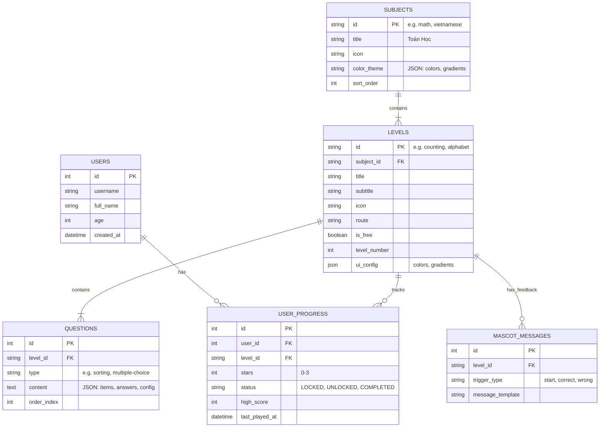

# Thiết Kế Cơ Sở Dữ Liệu (Dự Kiến) - Project Thuy Chi

Tài liệu này mô tả thiết kế cơ sở dữ liệu dựa trên phân tích cấu trúc Front-End (Angular) và dữ liệu mẫu (JSON mock data) hiện có của dự án.

## 1. Tổng Quan

Hệ thống cần lưu trữ:
- **Người dùng**: Thông tin các bé, độ tuổi.
- **Môn học (Subjects)**: Toán, Tiếng Việt, Tiếng Anh...
- **Cấp độ/Bài học (Levels)**: Chi tiết từng game nhỏ trong môn học (Ví dụ: Đếm số, Bảng chữ cái).
- **Nội dung bài học (Questions)**: Các câu hỏi, bài tập cụ thể.
- **Tiến độ học tập (Progress)**: Trạng thái hoàn thành, số sao, điểm số của người dùng.

Mô hình được đề xuất là **Lai (Hybrid)**: Sử dụng các bảng quan hệ (Relational) cho cấu trúc chính và JSON cho nội dung bài tập đa dạng.

## 2. Mô Hình Quan Hệ (ER Diagram)



## 3. Chi Tiết Các Bảng

### 3.1. Bảng `users`
Lưu thông tin người chơi.
| Column | Type | Description |
|--------|------|-------------|
| `id` | INT (PK) | Auto increment |
| `username` | VARCHAR | Tên đăng nhập (nếu có) |
| `full_name` | VARCHAR | Tên hiển thị của bé |
| `age` | INT | Tuổi (để gợi ý bài học phù hợp) |
| `avatar_url` | VARCHAR | Link ảnh đại diện (hoặc mascot đã chọn) |

### 3.2. Bảng `subjects`
Danh mục chính (Toán, Tiếng Việt...). Dữ liệu gốc từ `subjects.json`.
| Column | Type | Description |
|--------|------|-------------|
| `id` | VARCHAR (PK) | Mã môn học (math, vietnamese). Dùng String để dễ mapping FE. |
| `title` | VARCHAR | Tên hiển thị (Toán Học) |
| `icon` | VARCHAR | Emoji hoặc đường dẫn icon |
| `theme_config` | JSON | Lưu mã màu (`#3b82f6`) và gradient. Loại bỏ việc cứng cột màu. |
| `description` | TEXT | Mô tả ngắn |
| `active` | BOOLEAN | Ẩn/Hiện môn học |

### 3.3. Bảng `levels` (Modules)
Các bài học con (Đếm số, So sánh, Chữ cái...). Dữ liệu gốc từ `math-levels.json`, `vietnamese-levels.json`.
| Column | Type | Description |
|--------|------|-------------|
| `id` | VARCHAR (PK) | Mã bài học (counting, simple-words) |
| `subject_id` | VARCHAR (FK) | Thuộc môn nào (math, vietnamese) |
| `title` | VARCHAR | Tên bài (Đếm số) |
| `subtitle` | VARCHAR | Mô tả ngắn (Nhận biết 0-10) |
| `level_number` | INT | Số thứ tự bài học (1, 2, 3...) |
| `route` | VARCHAR | Đường dẫn Angular route (`/math/counting`) |
| `ui_config` | JSON | Chứa `color`, `gradient` riêng của từng level |
| `min_age` | INT | Độ tuổi tối thiểu khuyến nghị |

### 3.4. Bảng `questions`
Nội dung chi tiết từng màn chơi. Dữ liệu gốc từ các file `*-config.json` (ví dụ `sorting-config.json`).
*Lý do dùng cột `content` kiểu JSON*: Mỗi game (Sorting, Fill-in-blank, Logic) có cấu trúc dữ liệu hoàn toàn khác nhau.
| Column | Type | Description |
|--------|------|-------------|
| `id` | INT (PK) | Auto increment |
| `level_id` | VARCHAR (FK) | Thuộc level nào |
| `question_type` | VARCHAR | Loại câu hỏi (`sorting`, `calculation`, `find_missing`) |
| `content` | JSON | Chứa toàn bộ logic câu hỏi. |
| `order_index` | INT | Thứ tự xuất hiện câu hỏi |

**Ví dụ cấu trúc JSON trong cột `content`:**

#### a. Dạng bài 'Sắp xếp' (Static List - Sorting)
*Dữ liệu tĩnh, liệt kê chính xác từng câu hỏi.*
```json
{
  "question_text": "Sắp xếp các số theo thứ tự từ bé đến lớn",
  "data": {
    "order": "asc",
    "items": [5, 2, 8, 1],
    "correct_sequence": [1, 2, 5, 8]
  }
}
```

#### b. Dạng bài 'Tính toán' (Dynamic Config - Addition/Subtraction)
*Dữ liệu cấu hình, FE sẽ tự sinh câu hỏi ngẫu nhiên trong khoảng quy định.*
```json
{
  "mode": "dynamic_generation",
  "config": {
    "operator": "+",
    "range": { "min": 2, "max": 10 },
    "total_questions": 10,
    "points_per_question": 10,
    "ui_elements": ["apples", "ducks", "stars"] // Icon hiển thị
  },
  "feedback": {
    "correct": ["Giỏi quá!", "Đúng rồi!"],
    "wrong": ["Thử lại nhé!", "Sai rồi!"]
  }
}
```

#### c. Dạng bài 'Tiếng Việt' (Learning Content - Vietnamese)
*Dữ liệu dạng bài học (Flashcards), chứa ký tự, âm thanh và ví dụ.*
```json
{
  "type": "flashcard",
  "items": [
    {
      "id": "a",
      "text": "a",
      "audio_url": "/assets/audio/vn/a.mp3",
      "example": {
        "word": "cá",
        "image_url": "/assets/images/fish.png",
        "audio_url": "/assets/audio/vn/ca.mp3"
      }
    },
    {
      "id": "ă",
      "text": "ă",
      "audio_url": "/assets/audio/vn/aw.mp3",
      "example": {
        "word": "mặt trăng",
        "image_url": "/assets/images/moon.png",
        "audio_url": "/assets/audio/vn/mat-trang.mp3"
      }
    }
  ]
}
```

### 3.5. Bảng `user_progress`
Lưu kết quả học tập.
| Column | Type | Description |
|--------|------|-------------|
| `user_id` | INT (FK) | Người chơi |
| `level_id` | VARCHAR (FK) | Bài học |
| `stars` | INT | Số sao đạt được (0-3) |
| `status` | ENUM | `LOCKED`, `UNLOCKED`, `COMPLETED` |
| `score` | INT | Điểm số (nếu có) |
| `updated_at` | DATETIME | Thời gian hoàn thành gần nhất |

### 3.6. Bảng `mascot_messages` (Optional)
Lưu các câu thoại của nhân vật hỗ trợ (tách từ file config).
| Column | Type | Description |
|--------|------|-------------|
| `id` | INT (PK) | |
| `level_id` | VARCHAR (FK) | Áp dụng cho level nào (NULL = Global) |
| `trigger_event` | VARCHAR | `start` (mở bài), `correct` (trả lời đúng), `wrong` |
| `message` | TEXT | Nội dung hội thoại (có thể chứa placeholder `{name}`) |

## 4. Phân Tích Migrations từ FE Data

Để chuyển đổi từ Mock Data hiện tại sang Database:

1.  **Subjects**: Import từ `subjects.json`.
2.  **config (UI)**: Các field `color`, `gradient` trong `subjects.json` và `*-levels.json` sẽ được lưu vào cột `ui_config` hoặc `theme_config` dưới dạng JSON để linh hoạt cho FE render.
3.  **Levels**: Import từ `math-levels.json`, `vietnamese-levels.json`. Map `levelNumber` vào DB.
4.  **Questions**:
    - Với `sorting-config.json`: Duyệt mảng `questions`, mỗi phần tử là 1 record trong bảng `QUESTIONS`.
    - Với các game tạo ngẫu nhiên (Calculation): Có thể lưu "luật sinh đề" (Range 1-10, operator +) vào bảng `LEVELS` (thêm cột `game_rules` JSON) thay vì lưu từng câu hỏi tĩnh.

## 5. Công Nghệ Đề Xuất
- **Database**: MySQL 8.0+ hoặc PostgreSQL (Hỗ trợ JSON tốt).
- **ORM**: Prisma hoặc TypeORM (Dễ dàng mapping với TypeScript models hiện có).


